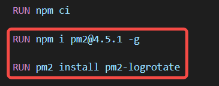
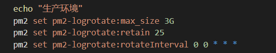
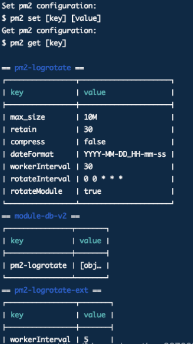
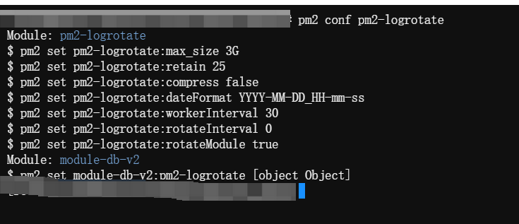
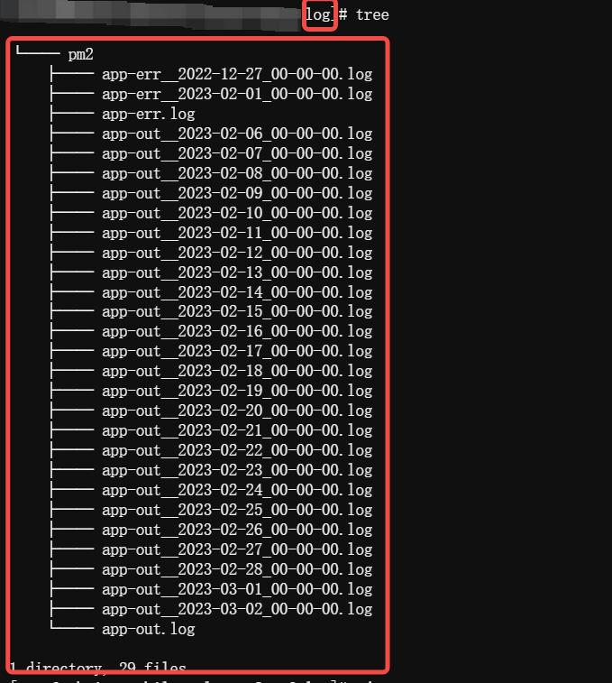

原文阅读: [PM2日志管理pm2-logrotate](https://mp.weixin.qq.com/s?__biz=Mzg4MDY5NDU4NQ==&mid=2247485897&idx=1&sn=1a1d993c09d0800f8020f66cd6ae9fc9&chksm=cf700d9ff80784890471204c6a7a78719f5bf0bd66e8355a5e22a21559f0ae40d170ea9c9d7b&token=2085106552&lang=zh_CN#rd)

- npm 源： 

# pm2-logrotate 简介
pm2-logrotate可以理解为是一个pm2的插件，它扩充了pm2本身没有功能：日志管理，所以它的运行需要依靠pm2，想用它必须先安装pm2才可以。



# 作用
pm2本身没有日志分割功能，日志只能存在一个文件中，时间久了日志文件非常大，查看起来很麻烦，并且一些日志过一段时间后可能就没用了，依然留着对空间也是浪费，有了该插件，可以将日志文件根据我们的设定进行分割，比如按天进行分割，把每天的日志文件分别存储，这样查看起来是不是比较方便？并且还可以设置日志文件的最大总数，比如我们设置日志文件最多100个，那么当日志文件超过100个后会自动将最早的日志文件删除掉，我们也不用再花时间去整理日志文件了
# 使用



<b>命令设置具体的参数，支持的参数有：</b>

- Compress：是否通过gzip压缩日志

- max_size：单个日志文件的大小，比如上图中设置为1K（这个其实太小了，实际文件大小并不会严格分为1K）

- retain：保留的日志文件个数，比如设置为10,那么在日志文件达到10个后会将最早的日志文件删除掉

- dateFormat：日志文件名中的日期格式，默认是YYYY-MM-DD_HH-mm-ss，注意是设置的日志名+这个格式，如设置的日志名为abc.log，那就会生成abc_YYYY-MM-DD_HH-mm-ss.log名字的日志文件

- rotateModule：把pm2本身的日志也进行分割

- workerInterval：设置启动几个工作进程监控日志尺寸，最小为1

- rotateInterval：设置强制分割，默认值是0 0 * * *，意思是每天晚上0点分割

# 常见操作
```buildoutcfg
pm2 conf pm2-logrotate
```




# 看下项目里面会如何分割？

我们来看一个next.js的项目，`pm2.config.js`文件如此配置

```buildoutcfg
module.exports = {
    apps: [
        {
            name: 'next',
            script: 'dist/server/index.js',
            instances: +process.env.CODE_SERVER_WORKERS || 4, // 最多四个实例，在matrix上，无法获取容器实例规格，设置max，实例数会取宿主物理机cpu数量
            cwd: './',
            watch: false,
            exec_mode: 'cluster',
            log_date_format: 'YYYY-MM-DD HH:mm:ss SSS',
            env: {
                "NODE_ENV": "production",
                "CODE_SERVER_ENV": "production"
            },
            error_file: '/home/work/log/pm2/app-err.log',
            out_file: '/home/work/log/pm2/app-out.log',
            merge_logs: true
        }
    ]
};
```

