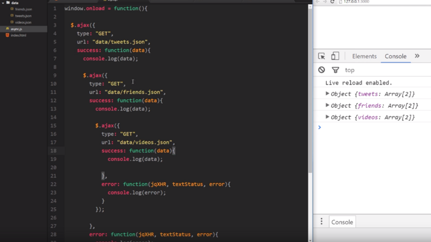

<!--
 * @Author: AlexZ33 775136985@qq.com
 * @Date: 2022-08-09 11:45:14
 * @LastEditors: AlexZ33 775136985@qq.com
 * @LastEditTime: 2022-08-09 11:47:50
 * @FilePath: /Promises/如何处理回调地狱.md
 * @Description: 这是默认设置,请设置`customMade`, 打开koroFileHeader查看配置 进行设置: https://github.com/OBKoro1/koro1FileHeader/wiki/%E9%85%8D%E7%BD%AE
-->
here is the Callback Hell

在早些年的时候, 大家会看到有很多的解决方案例如 Q, async, EventProxy 等等. 最后从流行程度来看 Promise 当之无愧的独领风骚, 并且是在 ES6 的 Javascript 标准上赢得了支持.

解决方案看我以前的文章:

[Promise初探](https://alexz33.github.io/2017/03/02/nodejs_promise/)