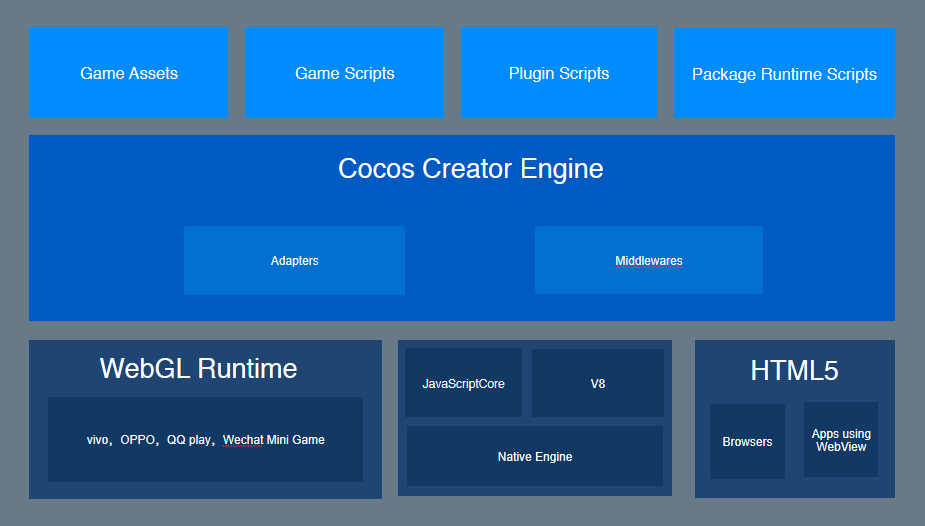

Cocos Creator 到底是什么？
## 一、游戏开发工具
Cocos Creator 是以内容创作为核心的游戏开发工具，在 Cocos2d-x 基础上实现了彻底脚本化、组件化和数据驱动等特点。
## 二、完整的游戏开发解决方案
在开发阶段，Cocos Creator 已经能够为用户带来巨大的效率和创造力提升，但其所提供的工作流远不仅限于开发层面。对于成功的游戏来说，开发和调试、商业化 SDK 的集成、多平台发布、测试、上线，这一整套工作流程不光缺一不可，而且要经过多次的迭代重复。
Cocos Creator 将整套手机页游解决方案整合在了编辑器工具里，无需在多个软件之间穿梭，只要打开 Cocos Creator 编辑器，各种一键式的自动化流程就能花最少的时间精力，解决上述所有问题。开发者就能够专注于开发阶段，提高产品竞争力和创造力！
## 三、技术架构
Cocos Creator 包含游戏引擎、资源管理、场景编辑、游戏预览和发布等游戏开发所需的全套功能，并且将所有的功能和工具链都整合在了一个统一的应用程序里。
编辑器在提供强大完整工具链的同时，提供了开放式的插件架构，开发者能够用 HTML + JavaScript 等前端通用技术轻松扩展编辑器功能，定制个性化的工作流程。
以下，是 Cocos Creator 的技术架构图。

从图中我们可以看出，编辑器是由 Electron 驱动再结合引擎所搭建的开发环境，引擎则负责提供许多开发上易于使用的组件和适配各平台的统一接口。
