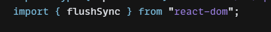
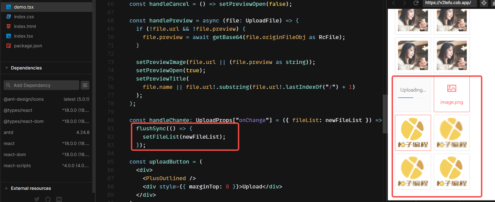

使用antd4 （react18）的上传组件时候遇到多组件上传没有re-render的问题

# 一、什么是批处理
批处理是 React将多个状态更新分组到单个re-render中以获得更好的性能的操作。（Batching is when React groups multiple state updates into a single re-render for better performance.）

例如，如果你在同一个点击事件中有两个状态更新，React 总是将它们分批处理到一个重新渲染中。如果你运行下面的代码，你会看到每次点击时，React 只执行一次渲染，尽管你设置了两次状态：

（For example, if you have two state updates inside of the same click event, React has always batched these into one re-render. If you run the following code, you’ll see that every time you click, React only performs a single render although you set the state twice:）

```
function App() {
  const [count, setCount] = useState(0);
  const [flag, setFlag] = useState(false);

  function handleClick() {
    setCount(c => c + 1); // Does not re-render yet
    setFlag(f => !f); // Does not re-render yet
    // React will only re-render once at the end (that's batching!)
  }

  return (
    <div>
      <button onClick={handleClick}>Next</button>
      <h1 style={{ color: flag ? "blue" : "black" }}>{count}</h1>
    </div>
  );
}

```
这对性能非常有用，因为它避免了不必要的重新渲染。它还可以防止您的组件呈现仅更新一个状态变量的“半完成”状态，这可能会导致错误。（This is great for performance because it avoids unnecessary re-renders. It also prevents your component from rendering “half-finished” states where only one state variable was updated, which may cause bugs. This might remind you of how a restaurant waiter doesn’t run to the kitchen when you choose the first dish, but waits for you to finish your order.）

在 React 18 之前，我们只在 React 事件处理程序期间批量更新。默认情况下，React 中不会对 promise、setTimeout、原生事件处理（native event handlers）或其它React默认不进行批处理的事件进行批处理操作。（Until React 18, we only batched updates during the React event handlers. Updates inside of promises, setTimeout, native event handlers, or any other event were not batched in React by default.）


# 二、setState 的批处理

React 18 之前
在 React 18 之前，React 只能在组件的生命周期函数或者合成事件函数中进行批处理。

默认情况下，Promise、setTimeout 以及原生事件中是不会对其进行批处理的。如果需要保持批处理，则可以用 unstable_batchedUpdates 来实现，但它不是一个正式的 API。

```
handleClick = () => {
  setTimeout(() => {
    console.log('setTimeout 更新之前：', this.state.num); // 0
    this.setState(state => ({ num: state.num + 1 }))
    console.log('setTimeout 更新之后：', this.state.num); // 1
  })
}


```

```
import ReactDOM from 'react-dom'
const { unstable_batchedUpdates } = ReactDOM

handleClick = () => {
  setTimeout(() => {
    unstable_batchedUpdates(()=>{
	  console.log('setTimeout 更新之前：', this.state.num); // 0
	  this.setState(state => ({ num: state.num + 1 }))
	  console.log('setTimeout 更新之后：', this.state.num); // 0
  	})
  })
}

```
React 18 之后
从 React 18的createRoot开始，所有更新都将自动批处理，无论它们来自何处。

这意味着timeouts, promises, native event handlers或任何其他事件内的更新将以与 React 事件内的更新相同的方式进行批处理
```
handleClick = () => {
  setTimeout(() => {
    console.log('setTimeout 更新之前：', this.state.num); // 0
    this.setState(state => ({ num: state.num + 1 }))
    console.log('setTimeout 更新之后：', this.state.num); // 0
  })
}

```
如果想在 React 18 退出批处理，官方提供了一个 API flushSync。

```
import { flushSync } from 'react-dom'; // Note: react-dom, not react

function handleClick() {
  flushSync(() => {
    setCounter(c => c + 1);
  });
  // React has updated the DOM by now
  flushSync(() => {
    setFlag(f => !f);
  });
  // React has updated the DOM by now
}

```

# flushSync实现

使用 ConcurrentMode 组件包裹的子组件的渲染过程的优先级会被降低，react 会先渲染优先级高的，然后将js线程空闲出来先干其他的事，如动画的渲染，完了之后再渲染优先级低的，当我们想提高子组件渲染的优先级的时候，可以使用flushSync方法来包裹需要进行的操作。

`react/packages/react-reconciler/ReactFiberWorkLoop.js`

```javascript

/ Overload the definition to the two valid signatures.
// Warning, this opts-out of checking the function body.
// eslint-disable-next-line no-unused-vars
declare function flushSync<R>(fn: () => R): R;
// eslint-disable-next-line no-redeclare
declare function flushSync(void): void;
// eslint-disable-next-line no-redeclare
export function flushSync<R>(fn: (() => R) | void): R | void {
  // In legacy mode, we flush pending passive effects at the beginning of the
  // next event, not at the end of the previous one.
  if (
    rootWithPendingPassiveEffects !== null &&
    rootWithPendingPassiveEffects.tag === LegacyRoot &&
    (executionContext & (RenderContext | CommitContext)) === NoContext
  ) {
    flushPassiveEffects();
  }

  const prevExecutionContext = executionContext;
  executionContext |= BatchedContext;

  const prevTransition = ReactCurrentBatchConfig.transition;
  const previousPriority = getCurrentUpdatePriority();

  try {
    ReactCurrentBatchConfig.transition = null;
    setCurrentUpdatePriority(DiscreteEventPriority);
    if (fn) {
      return fn();
    } else {
      return undefined;
    }
  } finally {
    setCurrentUpdatePriority(previousPriority);
    ReactCurrentBatchConfig.transition = prevTransition;

    executionContext = prevExecutionContext;
    // Flush the immediate callbacks that were scheduled during this batch.
    // Note that this will happen even if batchedUpdates is higher up
    // the stack.
    if ((executionContext & (RenderContext | CommitContext)) === NoContext) {
      flushSyncCallbacks();
    }
  }
}

```

以我们遇到的antd组件为例 https://codesandbox.io/s/zhao-pian-qiang-antd-4-24-8-forked-0m1804?file=/demo.tsx
参照此处理方式
```javascript
import { flushSync } from 'react-dom'; // Note: react-dom, not react

function handleClick() {
  flushSync(() => {
    setCounter(c => c + 1);
  });
  // React has updated the DOM by now
  flushSync(() => {
    setFlag(f => !f);
  });
  // React has updated the DOM by now
}
```
添加

# React的渲染模式
eact 批处理方式的改变，主要是因为改变了渲染模式，React 目前有三种渲染模式

- legacy 模式：ReactDOM.render(<App />, rootNode)。React 18 前的设计模式，这将创建一个以“遗留”模式运行的 root。使用此 API 会有一个警告，表明它已被弃用并切换到 New Root API。
- blocking 模式：
ReactDOM.createBlockingRoot(rootNode).render(<App />) 。可以视为 concurrent 的优雅降级版本和过渡版本
- concurrent 模式 ：ReactDOM.createRoot(rootNode).render(<App />)。这将创建一个在 React 18 中运行的 root，它添加了 React 18 的所有改进并允许使用并发功能。React 18 采用的模式，拥有不同的优先级，更新的过程可以被打断。


legacy 模式，根据 isBatchUpdate 判断是否批量更新，在 React 事件中有自动处理批更新的功能。非 React 事件想使用这个功能必须使用 `unstable_batchedUpdates`。

concurrent 模式，**是以优先级为依据对更新进行合并的。 每次更新会进行优先级的判定，相同优先级的任务会被合并**，所有的 setState 在默认情况下都是批处理更新的。


# 相关issue
https://github.com/ant-design/ant-design/issues/38545

# Reference

[Automatic batching for fewer renders in React 18](https://github.com/reactwg/react-18/discussions/21)

[一探那些令人興奮的 React 18 三大新 features](https://jason-memo.dev/posts/react-18/)

[React18 setState之 Automatic batching](https://segmentfault.com/a/1190000040908767)